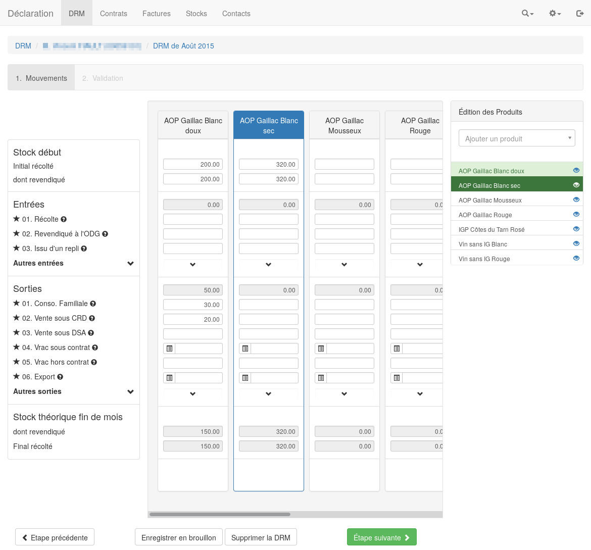

# GIILDA : Groupement IVSO IVBD de Logiciels dediés aux Déclarations Administratives

Projet de dématérialisation informatique des activités des interprofessions des Vins du Sud Ouest (IVSO) et de Bergerac (IVBD)

## Projets déployés

Le projet est actuellement en cours d'utilisation par  : 

* IVSO : https://declaration.ivsopro.com/ 
* IVBD : https://declaration.ivbdpro.fr/ 
* BIVC : https://declaration.vins-centre-loire.com/ 
* CIVA : https://declaration.vinsalsace.pro/ 

## Aperçu de l'application

## License utilisée

Ce logiciel est mis à disposition en licence AGPL

## Installation

## Via ansible

[Déployer via ansible](https://github.com/24eme/giilda/tree/master/ansible)

## Manuelle

Dépendances :

> sudo aptitude install couchdb libapache2-mod-php5 php5-cli php5-curl curl texlive-lang-french texlive-latex-extra libjson-perl

Get the source project :

> git clone git@github.com:24eme/giilde.git #Https recuperation https://github.com/24eme/giilde.git

> cd giilde

Configure the projet :

> make

You can configure your database settings in project/config/databases.yml

Create database :

> curl -X PUT http://localhost:5984/you_database_name

Load fixtures testing data (optional) :

> bash bin/fixtures_init_and_load.sh
