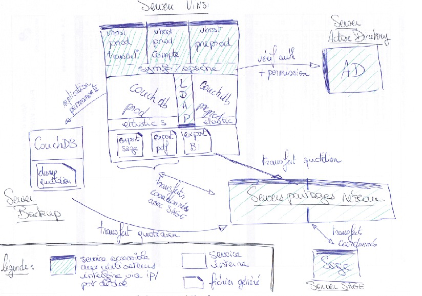
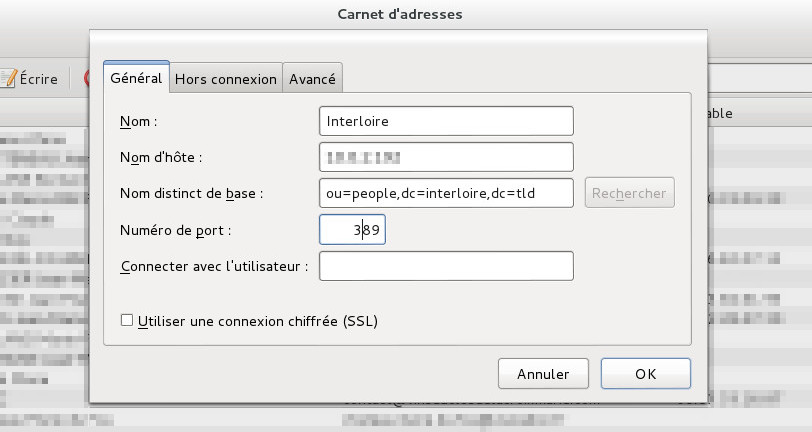
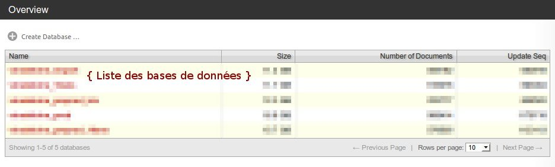
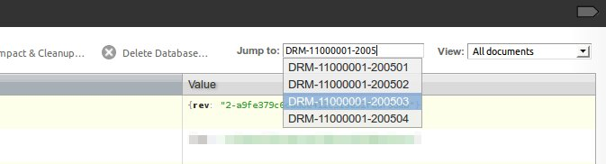
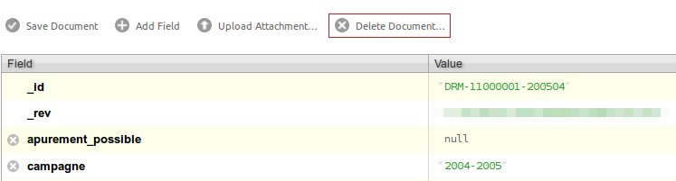

Documentation d'exploitation
============================

I. Pré-requis à l'installation
------------------------------

Configuration conseillé de la machine :

* Processeur à plusieurs coeurs
* 4 Go de Mémoire RAM au minimum, 8 idéalement
* Disque dur de 300 à 400 Go

Les autres informations nécessaire à l'installation sont présent dans la documentation technique.

II. Installation de linux
------------------------

L'installation de linux est trés bien décrite dans [ce livre](http://formation-debian.via.ecp.fr/intro-partie1.html).

### A. Distribution de linux

Les documentations sont obtimisées pour Debian.

Il faut prendre la denière version [stable](http://www.debian.org/distrib/).

### B. Partionnement des disques

L'idéal est de partionner le disque avec LVM

Puis de tous mettre sur une seule partition.

### C. Séléction des logiciels

Il faut juste laisser cocher "Serveur SSH" et "Utilitaires standard du système"

Pour avoir une interface graphique, cocher "Environnement graphique de bureau", mais elle n'est pas nécéssaire pour le fonctionnement de l'application.

III. Architecture
----------------

[Télécharger le schéma au format pdf](docs/architecture.pdf)

### A. Serveur applicatif

#### 1. Application

Symfony et apache

#### 2. Vhost

Deux instances prod et preprod 

Découpé en trois virtual host : 

* production transaction
* production contact
* preprod

#### 3. Couchdb

Base de données documentaires

Une base pour la prod et une autre pour la préprod

L'interface utilisateur pour consulter les bases est :

http://url_du_serveur::5984/_utils/

#### 4. LDAP

Annuaire des interlocuteurs de prod. 

L'application verse les infos dans le LDAP, mais ne les utilise pas.

Infos de connexion:

* host : "ip_du_serveur"
* port : "389"
* base : "ou=people,dc=interloire,dc=tld"
* utilisateurs : vide

Configurer thunderbird pour relier le carnet d'adresse avec le LDAP :

#### 5. Elasticsearch

Moteur de recherche à facettes alimenté par couchdb.

Les documents indexés sont les sociétés, les établissements, les interlocuteurs et les alertes 

La préprod et la prod ont chacune une base dans Elasticsearch.

L'interface utilisateur pour consulter les bases est :

http://url_du_serveur::9200/_plugin/head

### B. Serveur Active directory

Il contient la liste des utilisateurs interloire pouvant se connecter à l'application.

Apache se charge d'interroger l'AD pour autentifier les utilisateurs

L'application y récupère le champ __description__ pour lui affecter ses droits (admin, transaction, contacts, presse, ...). 

### C. Serveurs de partage

L'application accède à ses serveurs via des clients Samba.

Configuration du serveur applicatif pour pouvoir monter le dossier backup du serveur de partage.

Ajouter dans le fichier /etc/fstab :

    //ip_du_serveur_de_partage/BackupVinsi/ /mnt/samba  cifs  rw,user,credentials=/path_to/.smbauthentication 0 0

Le fichier .smbauthentication doit être de la forme :

    username =login_samba
    password =mot_de_passe_samba
    domain   =INTERLOIRE

Il existe deux serveurs de partage, un partage principal et un autre spécifique pour le BI.

Ces serveurs de stockages permettent de stocker :

* Les factures en PDFs
* Les backups de couchdb
* Les fichiers d'échanges avec SAGE
* Les exports BI

### D. Serveur de Backup

Il contient une instance de couchdb. Le serveur applicatif réplique de façon permanente la base couchdb de la prod vers ce serveur.
Dans le cas où la base de prod serait corrompu, ce base peut être utilisée pour la restaurer.

Cette technique permet également la sauvegarde cohérente et totale de la base qui est transférée au serveur de partage sans interruption de service sur la production.

IV. Backups
-----------

### A. Couchdb : Sauvegarde et Récupération de la base 

La réplication de la base de production vers celle de backup est automatisée.

Le serveur de backup possède un cron (une tâche reccurente) qui vérifie toutes les minutes que la replication continue des données a bien lieu.

Cette tâche relance alors le processus de réplication continue si celle-ci s'était suspendue.

Afin de posséder une version quotidienne de la base de donnée, une tâche créer un dump de la base répliquée et le tranfère vers le serveur de partage toutes les nuits.

En cas de problème ou de perte de la base de donnée de production, il est possible de récupérer cette version sauvegardée de la base depuis le serveur de partage.

Ceci peut se faire comme suit :

Passer par l'interface couchdb futon afin de répliquer la base sauvegardée dans le serveur de backup vers la base de production.

Néanmoins, si la base de backup est elle aussi inexistente ou inaccessible, il faudra récupérer le dump sur le serveur de partage, et l'installer en production en procédant ainsi :

1. Arrêter le service couchdb sur le serveur de production
2. Écraser les fichiers de la base de donnée couchdb actuelle de production par ceux du serveur de récupération
3. Re-démarrer le service couchdb sur le serveur de production

Pour en savoir plus sur la réplication continue dans CouchDB : http://guide.couchdb.org/draft/replication.html#continuous

V. Administration du fichier de paramétrage "app.yml"
--------------------------------------------------

### A. Accéder et modifier le fichier

#### 1. Editer le fichier app.yml

Se prémunir d'un éditeur de texte ([Liste des éditeurs texte sour linux](http://fr.wikipedia.org/wiki/%C3%89diteur_de_texte#Sous_UNIX_.2F_Linux)).

Depuis la racine du projet, editer le fichier project/config/app.yml

Le fichier app.yml est au format YAML, qui nécessite une compréhension et le respect de certaines règles.

**Les fichiers YAML**

[Documentation du format YAML](http://fr.wikipedia.org/wiki/YAML)

Ce qu'il faut retenir sur le format YML

Il s'agit d'une structure en arbre où chaque niveau est représenté par une indentation de deux espaces.

/!\ Pour l'indentation, il faut bien s'assurer de ne pas insérer un caractère "Tab" à la place des espaces.

Le # permet de mettre en commentaire la suite de la ligne.

#### 2. Tester son fonctionnement

Ce fichier est mis en cache, donc sa modification ne sera pas prise en compte dans l'appli tant que le cache n'est pas vidé.

Il est possible de tester l'appli en mode "dev", pour vérifier son bon fonctionnement, avant de l'appliquer.

Mode dév : http://url_de_lappli/vinsdeloire_dev.php

#### 3. Vider le cache

Si tout est ok, voici la procédure pour vider le cache :

Ouvrir un terminal et lancer les commandes suivantes :

    > cd /path_to_project/project
    > sudo -u www-data php symfony cc

Pour vérifier que l'app.yml est bien pris en compte bien penser à retirer vinsdeloire_dev.php de l'url

### B. Paramétrages des alertes

Pour bien comprendre, voici un petit rappel des statuts d'une alerte :

* Nouveau : Statut mis automatiquement à la création d'une alerte
* A traiter : Il s'agit d'un statut qui implique les même changement fonctionnels que le statut "Nouveau", mais qui permet à l'opérateur de trier ses alertes 
* En attente de réponse: Ce statut peut être passé humainement pour indiquer une attente de document ou autre, ou bien automatiquement après l'envoi d'une relance.
* A relancer : Statut qui (appliqué de manière automatique ou manuel) engendre la génération d'un courrier de relance.
* Résolu : Statut pour indiquer manuellement que l'alerte a été résolu
* Fermé : Le statut fermé est un statut automatique lorsque l'alerte est résolu mais non passé au statut "Résolu".
* En sommeil : Le statut en sommeil est un statut qui n'est pas relancable

Structure de la partie "alertes" du fichier app.yml :

    all:
      ...
      alertes:
        generations:
          TITRE_RELANCE:
            class: CLASS_RELACE
            creation_delai: '-6 month'
            relance_delai: '+1 month'
            relance_date: '15/12'
            enattente_delai: '+1 month'
            enattente_date: '15/12'
            nb_relance: '2'
            nb_campagne: '1'
            seuil: '10'
        ...

Le paramétrage des alertes s'effectue individuellement pour chacune d'elle à l'aide d'attributs. Ces attributs permettent de définir au bout de combien de temps lever l'alerte, quand la relancer, combien de fois, sur combien de campagne ou encore dans certain cas définir un pourcentage de seuil (pour les alertes d'écarts)

Liste des attributs :

* class : Classe PHP de la relance (ne pas modifier)

* création_date (type: date sans année au format jour/mois) : Date à laquelle l'alerte sera levé. Par exemple pour les contrats non soldés, si la "création_date" est le 15/06, tous les 15 juin de chaque année, l'ensemble des contrats non soldé leveront une alerte.

* création_delai (type: durée relative) : Interval de temps au bout duquel l'alerte est crée, exemple pour les contrats non soldés l'interval de temps est à '-6 month'. Ce qui signifie que l'alerte est levé 6 mois aprés la date de saisie d'un contrat qui est toujours non soldé. Pour cet attribut la date relative doit être négative (avec le signe '-' en début)

* relance_delai (type: durée relative) : Interval de temps (par rapport à la création de l'alerte) au bout duquel une alerte au statut "Nouveau" ou "A traiter" passera automatiquement au statut à relancer. Cette durée relative doit être positive.

* relance_date (type: date sans l'année) : Date à laquelle une alerte au statut "Nouveau" ou "A traiter" passera automatiquement au statut à relancer

* enattente_delai (type: durée relative) : Interval de temps entre le passage au statut "En attente de réponse" le prochain passage au statut "à relancer". Pour cet attribut la durée doit être positive (avec le signe + en début)

* enattente_date (type: date sans l'année) : Date à laquelle une alerte au statut "En attente de réponse" passera automatiquement au statut à relancer

* nb_relance (type: nombre entier) : Nombre de relance automatique maximum d'une alerte avant que celle-ci passe au statut en sommeil. L'alerte sera toujours relancable manuellement.

* seuil (type: nombre entier, pourcentage) : Sert à configurer un seuil de tolérance, notamment dans les écarts.

* nb_campagne (type: nombre entier) : Nombre de campagne à partir de la campagne courante sur laquelle appliquer la génération d'alerte.

/?\ les attributs "xxxxxxx_delai" et les "xxxxxxx_date" sont cumulatifs, par exemple on peut trés bien avoir "relance_delai" à 1 mois avec "relance_date" le 1er Janvier, les deux s'appliqueront.

Type d'attribut particulier :

* Durée relative : 
    C'est une chaine de caractères qui entre en compte dans le calcul d'une date à partir d'une autre date. Exemple '-1 month' avec une date au 1er février 2013 donnera la date du 1er janvier 2013.
    Exemple de syntaxe :
    * '-1 month +2 day' => 1 mois moins 2 jours avant la date du jour
    * 'last day of next month' => le dernier jour du prochain mois
    [Documentation complète du format](http://fr2.php.net/manual/fr/datetime.formats.relative.php)

* Date sans l'année :
    C'est une chaine de caractère décrivant une date sans année. Elle doit être au format 'dd/mm', par exemple le '15/06' correspond au 15 juin.

Liste des alertes :

* VRAC_NON_SOLDE : Contrats non soldé

* VRAC_PRIX_DEFINITIFS : Contrats à prix variable n'ayant pas de prix définitif

* VRAC_ATTENTE_ORIGINAL : Contrats en attente de l'original

* DRM_MANQUANTE : DRM manquantes, une DRM est considéré manquante par rapport à la période de la DRM la plus récente

* DRA_MANQUANTE : DRA manquante, une DRA est considéré manquante par rapport à la période de la DRA la plus récente

* DRM_STOCK_NEGATIF : DRM dont le stock d'un ou plusieurs produits est négatif

* SV12_MANQUANTE : SV12 manquante, une SV12 est considéré manquante par rapport à la période de la SV12 la plus récente

* VRAC_SANS_SV12 : Contrats qui n'ont pas été inclus dans une SV12

* DS_NON_VALIDEE : DS non validée

* ECART_DS_DRM_JUILLET : Ecart de volume (produit par produit) supérieur à un "seuil" de N% entre la DS et le stock fin de mois de la DRM de juillet

* ECART_DS_DRM_AOUT : Ecart de volume (produit par produit) supérieur à un "seuil" de N% entre la DS et le stock début de mois de la DRM d'août

* ECART_DREV_DRM : Ecart de volume (produit par produit) supérieur à un "seuil" de N% entre entre le stock révendiqué par l'ODG et celui revendiqué dans la DRM

### C. En-tête des factures

Structure de la partie "facture" du fichier app.yml :

    all:
      ...
      facture:
        emetteur:
          TOURS:
            adresse: 'adresse tours'
            code_postal: 'cp tours'
            ville: 'tours'
            service_facturation: 'nom prenom personne'
            telephone: 'tel tours - fax tours'
            email: 'emaildetours@tours.fr'
          ANGERS:
            adresse: 'adresse angers'
            code_postal: 'cp angers'
            ville: 'angers'
            service_facturation: 'nom prenom personne'
            telephone: 'tel angers - fax angers'
            email: 'emaildangers@angers.fr'
          NANTES:
            adresse: 'adresse nantes'
            code_postal: 'cp nantes'
            ville: 'nantes'
            service_facturation: 'nom prenom personne'
            telephone: 'tel nantes - fax nantes'
            email: 'emaildenantes@nantes.fr'
        ...

    /!\ Si il y a une apstrophe dans l'un des noms il faut l'échapper c'est à dire rajouter "\" devant soit "\'"

### D. Contenances

Dans les contrats bouteilles la liste des contenances est administrable

Structure de la partie "contrat" du fichier app.yml :

    all:
      ...
      vrac:
        contenances: #volume exprimé en hl
          "37,5 cl": 0.00375
          "50 cl": 0.005
          "75 cl": 0.0075
          "100 cl": 0.01
          "150 cl": 0.015
          "300 cl": 0.03
          "500 cl": 0.05
          "600 cl": 0.06
          "BIB 3l": 0.03
          "BIB 5l": 0.05
          "BIB 6l": 0.06
          "BIB 10l": 0.1
          "BIB 20l": 0.2
      ...

Pour ajouter une contenance, il faut donc ajouter une ligne du type : "libellé": 0.00 (avec le volume exprimé en hectolitre)

    /!\ La suppression d'une ligne de contenance est déconseillée, il faut mieux contacter l'équipe technique avant

### E. En-tête des courriers de relance

Structure de la partie "relance" du fichier app.yml :

    all:
      ...
      relance:
        responsable_financier: 'prenom nom'
        emetteur:
          TOURS:
            adresse: 'adresse tours'
            code_postal: 'cp tours'
            ville: 'tours'
            services_operateurs:
              - {nom: 'prenom nom', telephone: 'Tél : 00 00 00 00 00', email: 'emaildetours@tours.fr'}
              - {nom: 'prenom nom', telephone: 'Tél : 00 00 00 00 00', email: 'emaildetours@tours.fr'}
          ANGERS:
            adresse: 'adresse angers'
            code_postal: 'cp angers'
            ville: 'angers'
            services_operateurs:
              - {nom: 'prenom nom', telephone: 'Tél : 00 00 00 00 00', email: 'emaildangers@angers.fr'}
              - {nom: 'prenom nom', telephone: 'Tél : 00 00 00 00 00', email: 'emaildangers@angers.fr'}
          NANTES:
            adresse: 'adresse nantes'
            code_postal: 'cp nantes'
            ville: 'nantes'
            services_operateurs:
             - {nom: 'prenom nom', telephone: 'Tél : 00 00 00 00 00', email: 'emaildenantes@nantes.fr'}
             - {nom: 'prenom nom', telephone: 'Tél : 00 00 00 00 00', email: 'emaildenantes@nantes.fr'}
        ...

Les champs à éditer sont ceux entre simple quote "''" qui se situe après ":".

Les services opérateurs de chaque ville peuvent être multiples. Les attributs (nom, telephone, email) de chaque opérateur sont sur une ligne entre {} et séparé par des virgules.

    /!\ Si il y a une apostrophe dans l'un des noms il faut l'échapper c'est à dire rajouter "\" devant soit "\'"

### E. LDAP

### F. Active directory

VI. Exports, CRON et SAGE
---------------

### E. Exports et CRON

* Génération des PDFs, toutes les minutes.

* Génération et mise à jour des alertes à 03h00.

* Export BI vers le serveur de partage BI à 21h00 (en prod uniquement)

* Export Sage vers le serveur de partage à 21h30 (en prod uniqument)

* Flag des factures intégrés dans sage et export PDF de ces factures vers le serveur de partage à 23h45 (en prod uniqument)

### B. Echanges avec SAGE

Les échanges avec SAGE sont réalisés, tous les jours. Il s'effectue en plusieurs etapes.

#### 1. Export pour SAGE

1. Récupèration du fichier généré par sage InfosClientsSage.txt. Si celui-ci n'existe pas, l'opération s'arrête.

2. Test de la non existence du fichier VinsiClientsSage.txt sur le serveur de partage. Sa présence signifie qu'un import n'a pas pas correctement été intégré dans SAGE. Si c'est le cas, l'opération s'arrête.

3. Suppression des fichiers societes.csv et factures.csv du serveur de partage

4. Export CSV des sociétés aggrégé des infos contenus dans InfosClientsSage.txt: societes.csv

5. Export CSV des factures non intégrées dans SAGE : factures.csv

6. Construction du fichier SAGE à l'aide des deux CSV (societes.csv et factures.csv) : VinsiClientsSage.txt

7. Transfert des fichiers VinsiClientsSage.txt, societes.csv et factures.csv vers le serveur de partage dans le dossier //adresse_ip/Sage/Export/

#### 2. Intégration SAGE

SAGE importe le fichier VinsiClientsSage.txt déposé sur le serveur de partage, si tout ce passe bien il supprime le fichier.

#### 3. Post traitement

1. L'application vérifie que les tâches précédentes ce sont bien déroulées en vérifiant la présence des fichiers societes.csv et factures.csv. Si ils n'existent pas, l'opération s'arrete.

2. Pour vérifier que l'import dans SAGE s'est bien passé, on teste la non présence du fichier VinsiClientsSage.txt. Si il est présent, l'opération s'arrète.

3. Récupération des fichiers societes.csv et factures.csv depuis le serveur de partage

4. Archivage du fichier societes.csv dans le dossier data/factures/csv/date_du_jour/ et data/factures/csv/societes.last.csv de l'application.

5. Archivage du fichier factures.csv dans le dossier data/factures/csv/date_du_jour/ de l'application.

6. Export PDF des factures non intégré dans le dossier data/factures/ de l'application puis sur le serveur de partage dans le dossier //ip_du_serveur_de_partage/BackupVinsi/. 

7. Flag dans couchdb des factures contenues dans le fichier factures.csv récupérés.

8. Suppression des fichiers societes.csv et factures.csv du serveurs de partage.

Après tout ceci, qu'il y ai eu des erreurs ou non, un mail bilan est envoyé.

#### 4. Gérer les erreurs

**ERREUR le fichier InfosClientsSage.txt n'est pas present**

Le fichier InfosClientsSage.txt n'a pas pu être récupéré depuis le serveur de partage.

Il faut s'assurer que le fichier existe bien et qu'il est accessible pour la prochaine génération.

**ERREUR le fichier VinsiClientsSage.txt ne devrait pas être present**
et
**ERREUR IMPORT SAGE (le fichier VinsiClientsSage.txt ne devrait pas être present)**

Si cette erreur survient, c'est que SAGE n'a pas supprimé le fichier et donc que l'import ne s'est pas bien passé.

Il faut donc regarder pourquoi SAGE n'a pas réussi à importé le fichier, deux cas possibles :

1. Si ce n'est pas lié à une erreur dans le fichier VinsiClientsSage.txt, et qu'on peut estimer que SAGE pourra l'importer la prochaine fois, il n'y a rien à faire.

2. Si c'est lié à une erreur dans le fichier VinsiClientsSage.txt, il faut comprendre d'ou vient l'erreur et faire le nécessaire pour que la génération ne produise plus l'erreur, puis supprimer le fichier VinsiClientsSage.txt du serveur de partage. Il ne reste plus qu'a attendre la prochaine génération.

**ERREUR le fichier societes.csv n'a pas été trouvé sur le répertoire de partage**
et
**ERREUR le fichier factures.csv n'a pas été trouvé sur le répertoire de partage**

Il s'agit surement d'un bug dans l'application, qu'il faut corrigé.

VII. Administration de CouchDB
-------------------------

### A. Accès à CouchDB

L'accès à CouchDB se fait via un navigateur web.

URL : http://url_appli:5984/_utils/

### B. Supprimer des documents

A partir de l'interface de CouchDB

#### 1. Séléctionnez une base de données

Séléctionnez une base de donnée

#### 2. Chercher le document à supprimer

Les documents supprimables via CouchDB sont les DRM, SV12, VRAC (contrats), DS (Les DRev peuvent être supprimé via l'appli).

Liste de la structure des identifiants des documents : 

* DRM-IDENTIFIANT-YYYYMM(-MXX)
* SV12-IDENTIFIANT-YYYY-YYYY(-MXX)
* VRAC-DATEXXX
* DS-IDENTIFIANT-YYYYMM

Le champs de recherche est en autocomplétion sur l'id du document (ceci peut permettre de voir l'existence d'une modificatrice par exemple).

#### 3. Vérification

**DRM et SV12**

Vérifier que le document n'est pas facturé. Cette vérification peut se faire directement dans le document CouchDB, il faut regarder le noeud "mouvements", pour chacun d'eux contrôler que le champs "facture" est à 0. 

Vérifier que le document ne possède pas de version modificatrice (version supérieure). Pour cela il faut contrôler la non existence du document en incrémentant la version à la fin du document "-MXX" +1 (si cette partie n'existe pas l'ajouter en commencant à 1, soit M-01).

**Contrat**

Vérifier que le document n'est pas dans une SV12 ou dans une DRM directement dans l'application.

#### 4. Supprimer le document

Supprimer le document à l'aide du bouton "Delete Document"

VIII. Structure des documents de la base Couchdb
-----------------------------------------------

Les bases de données NoSQL, permettent de stocker des documents au format [JSON](http://fr.wikipedia.org/wiki/JavaScript_Object_Notation).

La base ne possède par réellement de schema. La structure est libre et les documents ne sont pas relié entre eux.

En revanche une structure de documents a été définis au niveau applicatif.

Un autre enjeu dans les base de données NoSQL sont les identifiants de documents, ils permettent de retrouver un document rapidement.

### A. Configuration

La configuration permet de stocker l'arbre produit.

[Voir la structure du document au format JSON](schema/configuration.json)

**Structure de l'identifiant**

Pour le moment, il en existe un seul qui se nomme "CONFIGURATION".

### B. Contrat

[Voir la structure du document au format JSON](schema/vrac.json)

**Structure de l'identifiant**

"VRAC-[DATE\_AU\_FORMAT\_YYYYMMDD][NUMERO\_INCREMENTAL\_SUR\_3\_CHIFFRES]"

par exemple : "VRAC-2013011100033"

### C. DRM

[Voir la structure du document au format JSON](schema/drm.json)

**Structure de l'identifiant**

"DRM-[IDENTIFIANT\_ETABLISSEMENT]-[PERIODE\_AU\_FORMAT\_YYYYMM]\(-M[NUMERO\_DE\_VERSION\_SUR\_2\_CHIFFRES]\)" (ce qui est entre parenthèse est optionnel)

Les documents soumis à facturation sont versionnés, pour garantir la cohérence ce qui a été facturé ou non.

par exemple : "DRM-11000001-200211" (version 0 du document) ou "DRM-11000001-200211-M01" (version 1 du document)

### D. SV12

[Voir la structure du document au format JSON](schema/sv12.json)

**Structure de l'identifiant**

"SV12-[IDENTIFIANT\_ETABLISSEMENT]-[CAMPAGNE\_AU\_FORMAT\_YYYY-YYYY]\(-M[NUMERO\_DE\_VERSION\_SUR\_2\_CHIFFRES]\)" (ce qui est entre parenthèse est optionnel)

Les documents soumis à facturation sont versionnés, pour garantir la cohérence ce qui a été facturé ou non.

par exemple : "SV12-40000901-2002-2003" (version 0 du document) ou "SV12-40000901-2002-2003-M01" (version 1 du document)

### E. DS

[Voir la structure du document au format JSON](schema/ds.json)

**Structure de l'identifiant**

"DS-[IDENTIFIANT\_ETABLISSEMENT]-[PERIODE\_AU\_FORMAT\_YYYYMM]"

par exemple :  "DS-11000101-201007"

### F. Facture

[Voir la structure du document au format JSON](schema/facture.json)

**Structure de l'identifiant**

"FACTURE-[ID\_SOCIETE]-[DATE\_AU\_FORMAT\_YYYYMMDD][NUMERO\_INCREMENTAL\_SUR\_2\_CHIFFRES]"

par exemple :  "FACTURE-110002-2013061901"

### G. Generation

Les documents de générations servent à générer les PDFs.

[Voir la structure du document au format JSON](schema/generation.json)

**Structure de l'identifiant**

"GENERATION-[TYPE\_DE\_DOCUMENT]-[DATE\_AU\_FORMAT\_YYYYMMDD][TEMPS\_AU\_FORMAT\_HHMMSS]"

par exemple : "GENERATION-FACTURE-20130301100859" ou "GENERATION-DS-20130115101813"

### H. Alerte

[Voir la structure du document au format JSON](schema/alerte.json)

**Structure de l'identifiant**

"ALERTE-[TYPE\_DE\_L'ALERTE]-[IDENTIFIANT\_DU\_DOCUMENT]"

par exemple : "ALERTE-DRM\_MANQUANTE-DRM-11000101-201108" ou "ALERTE-VRAC\_ATTENTE\_ORIGINAL-VRAC-2010070107629"

### I. Societe

[Voir la structure du document au format JSON](schema/societe.json)

**Structure de l'identifiant**

"SOCIETE-[IDENTIFIANT\_SOCIETE\_SUR\_6\_CHIFFRES]"

par exemple : "SOCIETE-060001"

### J. Etablissement

[Voir la structure du document au format JSON](schema/etablissement.json)

**Structure de l'identifiant**

"ETABLISSEMENT-[IDENTIFIANT\_SOCIETE\_SUR\_6\_CHIFFRES][IDENTIFIANT\_CHAI\_SUR\_2\_CHIFFRES]"

par exemple : "ETABLISSEMENT-06000101"

### K. Compte

[Voir la structure du document au format JSON](schema/compte.json)

**Structure de l'identifiant**

"COMPTE-[IDENTIFIANT\_SOCIETE][NUMERO\_INCREMENTAL\_SUR\_2\_CHIFFRES]"

par exemple : "COMPTE-06000101"

IX. Mise en production de l'application
-----------------------------------------------

### A. Vérification préliminaire

* Vérifier les changements effectués parfois à la volée sur le serveur de production avec 
> git status

Si des changements dans l'arborescence de l'application ont été effectuées il faut les checkouter et les inclure dans le projet versionné.

* Vérifier qu'il n'y aie aucune vue couchdb qui ait changé. Si tel est le cas il faut les modifier directement dans l'interface Futon de couchDb.

* Vérifier les changement de Configuration (liées à l'object Configuration) auquel cas ces changement doivent eux aussi être passé sur CouchDb.

* Vérifier les fichiers de conf de l'application et modifier ceux-ci sur le serveur avec vi s'ils sont modifiés.
 

### B. TAGGING de la version de l'application

* Vérifier que tout les submodule soit bien à jour avec git submodule update à la racine

* Lister les différentes version de l'application avec 
 > git tag

afin de repérer la dernière version de mise en production.

* Tagger le version de l'application avec 
 > git tag -a nouvelle_version -m 'commentaire'

on utilise comme commentaire la date du jour du tagging et pour le nom de version VINSI-X.X

Il faudra ensuite faire
 > git push origin VINSI-X.X

pour pusher sur le serveur git le tag de version de l'application. 

### C. Mettre à jour l'application

On utilise
 > git fetch
 > git checkout VINSI-X.X
 > git submodule update
 > php symfony cc
à la racine de l'application pour mettre à jour le projet
